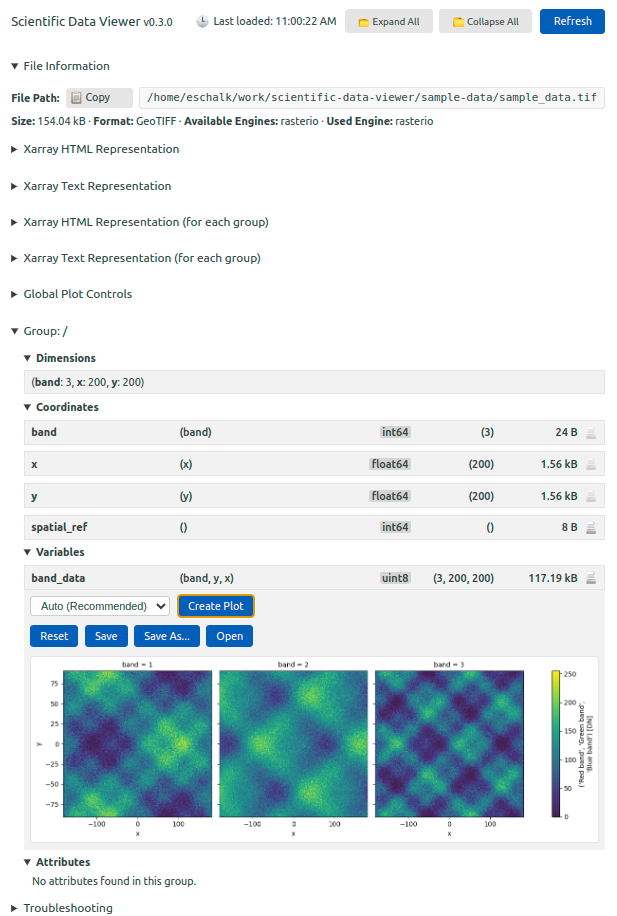
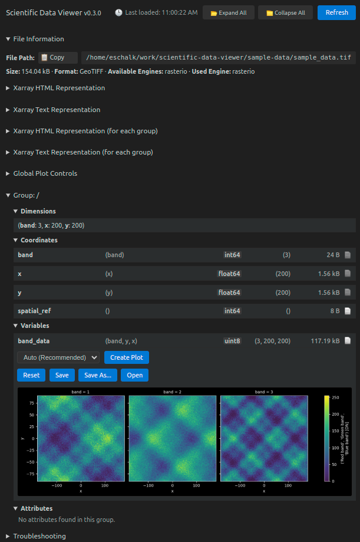

# Scientific Data Viewer - VSCode Extension

<div align="center">
  
</div>

An extension to explore the metadata of scientific data files within your IDE, including NetCDF, Zarr, HDF5, GRIB, GeoTIFF and JPEG-2000.

<div align="center">

**Current Version: v0.3.0** • [Release Notes](./docs/RELEASE_NOTES_0.3.0.md)

Available on:
[VSCode Marketplace](https://marketplace.visualstudio.com/items?itemName=eschalk0.scientific-data-viewer) • [Open VSX](https://open-vsx.org/extension/eschalk0/scientific-data-viewer)

</div>

## 🚀 Features

-   **Multi-format Support**:

| Format    | File Extension           |
| --------- | ------------------------ |
| NetCDF    | .nc, .netcdf, .nc4, .cdf |
| Zarr      | .zarr                    |
| HDF5      | .h5, .hdf5               |
| GRIB      | .grib, .grib2, .grb      |
| GeoTIFF   | .tif, .tiff, .geotiff    |
| JPEG-2000 | .jp2, .jpeg2000          |

-   **Python Integration**: Automatic Python environment detection and management
-   **File Tree Integration**: Right-click on supported files in the explorer to open them
-   **Custom Editors**: Direct file opening with dedicated editors
-   **Interactive Data Explorer**: Browse file structure, dimensions, variables, and attributes
-   **Browse Variable Information**: View variable dimension names, data types, shapes, and memory usage
-   **Basic Data Visualization**: Create plots and visualizations directly in VSCode **(experimental, best effort)**
-   **Command Palette Integration**: Multiple commands for data viewer operations
-   **Status Bar Integration**: Shows current Python interpreter status
-   **Human-readable File Sizes**: Display file and variable sizes in appropriate units (B, kB, MB, GB, TB)
-   **Easy Settings Access**: <kbd>Ctrl</kbd>+<kbd>Shift</kbd>+<kbd>P</kbd> ➜ _Scientific Data Viewer: Show Settings_
-   **Error Handling**: Robust error handling with user-friendly messages
-   **Experimental Features**: Configurable experimental features with clear warnings

## 📸 Screenshot Gallery

**Data Visualization and Plotting**

<div align="center">
  <a href="media/screenshots/light-tif-plot-0.3.0.png" target="_blank">
    
  </a>
  <p><em>Light theme: GeoTIFF data visualization with plotting capabilities</em></p>
</div>

<div align="center">
  <a href="media/screenshots/dark-tif-plot-0.3.0.png" target="_blank">
    
  </a>
  <p><em>Dark theme: GeoTIFF data visualization with plotting capabilities</em></p>
</div>

<div align="center">
  <a href="media/screenshots/light-tif-plot-opened-0.3.0.png" target="_blank">
    
  </a>
  <p><em>Light theme: GeoTIFF plot in opened/expanded state</em></p>
</div>

**Data Structure Exploration**

<div align="center">
  <a href="media/screenshots/light-nc-xarray-html-and-text-repr-0.3.0.png" target="_blank">
    
  </a>
  <p><em>Light theme: NetCDF file with xarray HTML and text representation</em></p>
</div>

<div align="center">
  <a href="media/screenshots/light-zarr-tree-view-focus-on-variable-0.3.0.png" target="_blank">
    
  </a>
  <p><em>Light theme: Zarr dataset tree view with variable focus</em></p>
</div>

## 📦 Installation

1. **Install from VSCode Marketplace**:

    - Open VSCode
    - Go to Extensions view (`Ctrl+Shift+X`)
    - Search for "Scientific Data Viewer"
    - Click Install

2. **Install required Python dependencies**: (prompted by extension)

    ```bash
    pip install xarray matplotlib
    ```

3. **Install optional Python dependencies**: (prompted by extension)

    ```bash
    pip install netCDF4 h5py rioxarray cfgrib zarr
    ```

4. **Open a supported file 🎉**

## ⚙️ Prerequisites

Before using this extension, you need:

1. **Python 3.13+** installed on your system
    - Former versions may work, but it is not guaranteed nor supported.
2. **Required Python packages**:
    - xarray
    - matplotlib
3. **Optional Python packages**:
    - netCDF4
    - h5py
    - rioxarray
    - cfgrib
    - zarr

## 🎯 Usage

### 🐍 Configuring Python Environment

The extension supports multiple ways to configure your Python environment:

1. **Extension Virtual Environment** (Semi-Standalone):

    - **uv Required**: If `uv` is installed, the extension creates its own isolated environment
    - **Python 3.13**: Uses uv to install and use Python 3.13 for optimal performance
    - **Self-Contained**: Works without external Python environment setup
    - **Isolated**: Won't interfere with your other projects
    - **Storage**: Stored in VSCode's extension storage space
    - **Fallback**: If uv is not available, falls back to Python extension behavior

2. **Python Extension Integration** (Default):

    - Press <kbd>Ctrl</kbd>+<kbd>Shift</kbd>+<kbd>P</kbd>
    - Type "Python: Select Interpreter"
    - Choose your preferred Python environment
    - The extension will automatically detect it and use it

3. **Environment Management Commands**:

    - **Create Extension Environment**: Create the extension's own virtual environment (requires uv)
    - **Manage Extension Environment**: View status and manage the extension environment
    - **Delete Extension Environment**: Remove the extension's virtual environment

#### Virtual Environment Examples

**Using Extension Virtual Environment (Semi-Standalone)**:

```bash
# Prerequisites: Install uv first
# curl -LsSf https://astral.sh/uv/install.sh | sh
# or: pip install uv

# Enable extension virtual environment in settings
# Set scientificDataViewer.useExtensionEnvironment to true

# Or use the command palette:
# Ctrl+Shift+P → "Create Extension Virtual Environment"

# The extension will automatically:
# 1. Check if uv is available
# 2. If uv is available: Install Python 3.13 and create environment
# 3. If uv is not available: Fall back to Python extension behavior
# 4. Install all required packages using uv (if available) or pip
# 5. Use this environment for all operations
```

**Using uv (recommended for modern Python projects)**:

```bash
# Create a uv environment
uv venv

# Install required packages
uv pip install xarray matplotlib netCDF4 zarr h5py

# The extension will automatically detect and use .venv/bin/python
```

**Using venv**:

```bash
# Create a virtual environment
python -m venv venv

# Activate and install packages
source venv/bin/activate  # On Windows: venv\Scripts\activate
pip install xarray matplotlib netCDF4 zarr h5py

# The extension will detect and use venv/bin/python
```

**Using conda**:

```bash
# Create a conda environment
conda create -n myenv python=3.11
conda activate myenv
conda install xarray matplotlib netcdf4 zarr h5py

# The extension will detect and use the conda environment
```

### 📂 Opening Data Files

1. **Direct File Opening**:

    - Double-click on any supported file
    - Files open directly in the Scientific Data Viewer

2. **From File Explorer**:

    - Right-click on any supported file
    - Select "Open in Scientific Data Viewer"

3. **From Command Palette**:

    - Press <kbd>Ctrl</kbd>+<kbd>Shift</kbd>+<kbd>P</kbd>
    - Type "Open Scientific Data Viewer"
    - Select a file from the file picker

4. **Auto-detection**:
    - Open any supported file in VSCode
    - The extension will detect it and offer to open it in the data viewer

### 🔬 Exploring Data

You can explore the data via the editor itself, or via the _Data Structure_ tree view displayed on the VSCode's left pane.

The data viewer editor shows:

-   **File Information**: Path, size, format, and basic metadata
-   **Xarray HTML and Text Representations**: Users that are habituated to xarray will be happy to see the well-known views. Uses DataTree or Dataset representation, depending on the file format.
-   **Xarray HTML and Text Representations (for each group)**: Relevant for multi-group datasets. Nested groups are flattened (using a sorted [`DataTree.to_dict()`](https://docs.xarray.dev/en/latest/generated/xarray.DataTree.to_dict.html)). Dataset representations are always used for groups.
-   **Global Plot Controls** (:warning: EXPERIMENTAL): Use at your own risk. It will trigger plotting operations for all available variables. It is not optimized at all, and usage is not really recommended.
-   **Groups**: The extension's data representation proposal. The view is inspired by the xarray HTML representation, with additional plotting controls. Feature parity is not reached yet as no sample data is currently displayed.
    -   **Dimensions**: Dataset dimensions and their sizes
    -   **Coordinates**: All coordinates with their types, shapes, dimension names, and memory usage. Attributes can be revealed when clicking on a coordinate..
    -   **Variables**: All data variables with their types, shapes, dimension names, and memory usage. Attributes can be revealed when clicking on a variable.
        -   **Plot Controls** (:warning: EXPERIMENTAL): "Create Plot" button for a variable, that tries the best effort to produce a plot of the variable using matplotlib. Currently, only an "auto" (best effort) plot mode is supported.
    -   **Attributes**: Show group's attributes.

## ⚙️ Settings

The extension can be configured through VSCode settings:

| Setting                                                                                      | Description                                                                                                                                                                                                                                                                                                                      |
| -------------------------------------------------------------------------------------------- | -------------------------------------------------------------------------------------------------------------------------------------------------------------------------------------------------------------------------------------------------------------------------------------------------------------------------------- |
| `scientificDataViewer.maxFileSize` <br> (type: `number`, default: `10000`)                   | Maximum file size in MB to load automatically                                                                                                                                                                                                                                                                                    |
| `scientificDataViewer.defaultView` <br> (type: `string`, default: `"default"`)               | Default view mode for data display. **Options:** `default`                                                                                                                                                                                                                                                                       |
| `scientificDataViewer.allowMultipleTabsForSameFile` <br> (type: `boolean`, default: `false`) | ⚠️ **Experimental** - Allow opening multiple tabs for the same file. When enabled, each 'Open in Data Viewer' action creates a new tab. When disabled (default), focuses on existing tab if file is already open.                                                                                                                |
| `scientificDataViewer.devMode` <br> (type: `boolean`, default: `false`)                      | Enable development mode. When enabled, automatically runs 'Show Extension Logs' and 'Open Developer Tools' commands when a scientific data file is opened. Also reloads the webview script and CSS for faster development feedback loops.                                                                                        |
| `scientificDataViewer.matplotlibStyle` <br> (type: `string`, default:`""` (empty string))    | Matplotlib plot style for data visualizations. If empty, automatically detects VSCode theme and applies appropriate style (light theme → `default`, dark theme → `dark_background`). If set, overrides automatic detection. **Examples:** `default`, `dark_background`, `seaborn`, `ggplot`, or any valid matplotlib style name. |

**🐍 Virtual Environment Settings**

The extension includes specific settings for virtual environment management:

-   **`scientificDataViewer.overridePythonInterpreter`** (string, default: `""`): Override the Python interpreter path (takes precedence over all other options). If set, this will take precedence over the extension's own virtual environment, Python extension's interpreter, and any auto-detected environments.
-   **`scientificDataViewer.currentlyInUseInterpreter`** (string, default: `""`): Shows the currently active Python interpreter path being used by the extension. This is automatically updated when the interpreter changes and is read-only.
-   **`scientificDataViewer.useExtensionEnvironment`** (boolean, default: `false`): Use the extension's own virtual environment instead of the Python extension's interpreter. When enabled, the extension will create and use its own isolated virtual environment stored in VSCode's extension storage. **Requires `uv` to be installed** - if uv is not available, the extension will fall back to using the Python extension's interpreter. The extension will automatically use `uv` to install Python 3.13 and create the environment with all required packages.

**🚩 Feature Flags**

The extension includes configuration options that act as feature flags to control specific behaviors:

-   **`scientificDataViewer.allowMultipleTabsForSameFile`** (Experimental): Allow opening multiple tabs for the same file
-   **`scientificDataViewer.devMode`** (Aimed at developers): Enable development mode

### 🎮 Available Commands

Access these commands via the Command Palette (<kbd>Ctrl</kbd>+<kbd>Shift</kbd>+<kbd>P</kbd>):

| Command                                                        | Description                                             |
| -------------------------------------------------------------- | ------------------------------------------------------- |
| `Scientific Data Viewer: Open Scientific Data Viewer`          | Opens the Scientific Data Viewer for the current file   |
| `Scientific Data Viewer: Refresh Python Environment`           | Refreshes the Python environment used by the extension  |
| `Scientific Data Viewer: Show Extension Logs`                  | Opens the extension's log output for debugging          |
| `Scientific Data Viewer: Show Settings`                        | Opens the extension settings                            |
| `Scientific Data Viewer: Open Developer Tools`                 | Opens the developer tools for the webview               |
| `Scientific Data Viewer: Select Python Interpreter`            | Choose from detected virtual environments               |
| `Scientific Data Viewer: Detect Virtual Environments`          | Scan workspace for virtual environments                 |
| `Scientific Data Viewer: Reset to Default Python Interpreter`  | Use Python extension's default interpreter              |
| `Scientific Data Viewer: Create Extension Virtual Environment` | Create the extension's own isolated virtual environment |
| `Scientific Data Viewer: Manage Extension Virtual Environment` | View status and manage the extension environment        |
| `Scientific Data Viewer: Delete Extension Virtual Environment` | Remove the extension's virtual environment              |

### 🖱️ Context Menu Commands

Right-click on supported file types in the Explorer to access:

-   **Open in Data Viewer** - Opens the file in the Scientific Data Viewer

**Supported file formats:** `.nc`, `.netcdf`, `.zarr`, `.h5`, `.hdf5`, `.grib`, `.grib2`, `.grb`, `.tif`, `.tiff`, `.geotiff`, `.jp2`, `.jpeg2000`, `.safe`, `.nc4`, `.cdf`

## 🔧 Troubleshooting

### ⚠️ Common Issues

1. **Python not found**:

    - Ensure Python is installed and in your PATH
    - Use the "Python: Select Interpreter" command to manually set the path
    - Consider using the extension's own virtual environment for a self-contained solution

2. **uv not available**:

    - Install uv manually: `pip install uv` or `curl -LsSf https://astral.sh/uv/install.sh | sh`
    - If uv is not installed, the extension will fall back to using the Python extension's interpreter
    - When using uv, the extension automatically installs Python 3.13 for optimal performance

3. **Missing packages**:

    - Install required packages: `pip install xarray netCDF4 zarr h5py numpy matplotlib`
    - Or let the extension install them automatically

4. **Large files not loading**:

    - Increase the `maxFileSize` setting
    - Consider using data slicing for very large datasets

5. **Permission errors**:
    - Ensure the extension has permission to read your data files
    - Check file permissions and VSCode workspace settings

### 💬 Getting Help

-   **Consult the Troubleshooting section**: Available at the end of the opened file. Copy buttons are present to help creating an issue.
-   **Check the logs**: <kbd>Ctrl</kbd>+<kbd>Shift</kbd>+<kbd>P</kbd> (Command Palette) and "Scientific Data Viewer: Show Extension Logs"
-   **Report issues**: [Create an issue (🐛 Bug Report) on the GitHub repository](https://github.com/etienneschalk/scientific-data-viewer/issues/new?template=bug_report.yml)
-   **Ask questions**: [Create an issue (❓ Question / Discussion) on the GitHub repository](https://github.com/etienneschalk/scientific-data-viewer/issues/new?template=question.yml)
-   **I would like a specific feature**: [Create an issue (✨ Feature Request) on the GitHub repository](https://github.com/etienneschalk/scientific-data-viewer/issues/new?template=feature_request.yml) to suggest a new feature or enhancement for the Scientific Data Viewer extension

---

## 🛠️ Development

### ⚡ Quick Start for Developers

1. **Clone and setup**:

    ```bash
    git clone https://github.com/etienneschalk/scientific-data-viewer.git
    cd scientific-data-viewer
    ./setup.sh
    ```

2. **Open in VSCode**:

    ```bash
    code .
    ```

3. **Run extension**:
    - Press `F5` to launch Extension Development Host
    - Test with sample data files

Recommended VSCode extension: [es6-string-html](https://marketplace.visualstudio.com/items?itemName=Tobermory.es6-string-html)

### 🔧 Development Installation

1. **Clone the repository**:

    ```bash
    git clone https://github.com/etienneschalk/scientific-data-viewer.git
    cd scientific-data-viewer
    ```

2. **Install dependencies**:

    ```bash
    npm install
    ```

3. **Compile the extension**:

    ```bash
    npm run compile
    ```

4. **Install Python dependencies** (if not already installed):

    ```bash
    pip install xarray matplotlib
    ```

5. **Open in VSCode**:

    ```bash
    code .
    ```

6. **Run the extension**:
    - Press `F5` to open a new Extension Development Host window
    - Or use <kbd>Ctrl</kbd>+<kbd>Shift</kbd>+<kbd>P</kbd> and run "Developer: Reload Window"

### 📦 Production Installation

1. **Package the extension**:

    ```bash
    npm run package
    ```

2. **Install the .vsix file**:
    - Open VSCode
    - Go to Extensions view (`Ctrl+Shift+X`)
    - Click the "..." menu and select "Install from VSIX..."
    - Select the generated `.vsix` file

### 📜 Python Scripts

The extension uses several Python scripts for data processing:

-   **`get_data_info.py`**:
    -   Extracts file metadata, dimensions, variables, and their properties,
    -   Creates HTML representation of xarray datasets
    -   Creates text representation of datasets
    -   Generates visualizations using matplotlib
    -   Shows Python package versions for debugging
-   **`create_sample_data.py`**:
    -   Generates sample data files for testing

Disclaimer: most visualization scripts are experimental and can produce unusable plots!

### 🏗️ Building

```bash
# Compile TypeScript
npm run compile

# Watch for changes
npm run watch

# Run tests
npm test

# Lint code
npm run lint
```

### 🧪 Testing

1. **Unit Tests**:

    ```bash
    npm test
    ```

2. **Integration Tests**:
    - Open the extension in development mode
    - Test with sample data files
    - Verify Python integration works correctly

### 🐛 Debugging

1. **Set breakpoints** in your TypeScript code
2. **Press F5** to launch the Extension Development Host
3. **Use the debug console** to inspect variables and step through code

Note: It is recommended to run the task `start-watch-mode` for hot reload with
<kbd>Ctrl</kbd>+<kbd>Shift</kbd>+<kbd>P</kbd> Tasks: Run Task then `start-watch-mode`.

Note: It is recommended to enable the `scientificDataViewer.devMode` feature flag during development.

**About debugging the error handling**

To get a clean state in the development VSCode instance, uninstall dependencies
to test the full error handling scenarios

```
python -m pip uninstall xarray matplotlib numpy netCDF4 h5py rioxarray cfgrib zarr
```

Then reload the development VSCode instance window: <kbd>Ctrl</kbd>+<kbd>Shift</kbd>+<kbd>P</kbd> Developer: Reload Window

**See the Webview console logs**

<kbd>Ctrl</kbd>+<kbd>Shift</kbd>+<kbd>P</kbd>: Open Webview Developer Tools

## 🤝 Contributing

We welcome contributions! Please see our [Contributing Guidelines](CONTRIBUTING.md) for details.

**Development Setup**

1. Fork the repository
2. Create a feature branch
3. Make your changes
4. Add tests if applicable
5. Submit a pull request

## 📄 License

This project is licensed under the MIT License - see the [LICENSE](LICENSE) file for details.

## 🙏 Acknowledgments

-   Inspired by the [NetCDF Viewer](https://github.com/rmcd-mscb/netcdf-viewer) extension
-   Built with [xarray](https://xarray.pydata.org/) for scientific data processing
-   Uses [VSCode Extension API](https://code.visualstudio.com/api) for integration

## 📁 Project Structure

**Disclaimer**: The information below is provided for reference purposes only and may be outdated. Please refer to actual source code for the most current information.

```
scientific-data-viewer/
├── src/                          # TypeScript source code
│   ├── extension.ts              # Main extension entry point and command registration
│   ├── dataProcessor.ts          # Python integration and data processing
│   ├── dataViewerPanel.ts        # Webview panel for data visualization
│   ├── pythonManager.ts          # Advanced Python environment management
│   ├── logger.ts                 # Comprehensive logging utilities
│   ├── communication/            # Message passing system
│   │   ├── MessageBus.ts         # Message bus for communication
│   │   └── MessageTypes.ts       # Type definitions for messages
│   ├── error/                    # Error handling
│   │   └── ErrorBoundary.ts      # Error boundary component
│   ├── state/                    # Application state management
│   │   └── AppState.ts           # Global application state
│   ├── events/                   # Event handling (empty)
│   └── ui/                       # User interface components
│       ├── CSSGenerator.ts       # CSS generation utilities
│       ├── HTMLGenerator.ts      # HTML generation utilities
│       ├── JavaScriptGenerator.ts # JavaScript generation utilities
│       ├── UIController.ts       # UI controller logic
│       └── webview/              # Webview assets
│           ├── styles.css        # Webview styles
│           └── webview-script.js # Webview JavaScript
├── python/                       # Python scripts for data processing
│   ├── get_data_info.py          # Extract file metadata and variable info
│   ├── create_sample_data.py     # Generate sample data files
│   └── tests.ipynb              # Jupyter notebook for testing
├── test/                         # Test files
│   ├── runTest.ts               # Test runner
│   └── suite/                   # Test suites
├── sample-data/                  # Sample data files for testing
│   ├── sample_data.nc           # NetCDF sample file
│   ├── sample_data.h5           # HDF5 sample file
│   ├── sample_data.grib         # GRIB sample file
│   ├── sample_data.jp2          # JPEG2000 sample file
│   ├── sample_data.tif          # GeoTIFF sample file
│   ├── sample_data.zarr/        # Zarr sample datasets
│   │   ├── sample_zarr_arborescence.zarr/
│   │   ├── sample_zarr_inherited_coords.zarr/
│   │   ├── sample_zarr_nested_groups_from_datatree.zarr/
│   │   ├── sample_zarr_nested_groups_from_zarr.zarr/
│   │   └── sample_zarr_single_group_from_dataset.zarr/
│   ├── broken_file.*            # Test files for error handling
│   └── sdv-plots/               # Generated plot outputs
├── docs/                         # Documentation
│   ├── ARCHITECTURE_IMPROVEMENTS.md
│   ├── DEVELOPMENT.md            # Development guide
│   ├── PUBLISHING.md             # Publishing guide
│   ├── QUICKSTART.md             # Quick start guide
│   ├── TECHNICAL_ARCHITECTURE.md # Technical architecture docs
│   ├── test-extension.md         # Extension testing guide
│   └── rfc/                      # Request for Comments
│       ├── README.md
│       └── 001-033-*.md         # RFC documents
├── media/                        # Media assets
│   ├── icon.png                 # Extension icon
│   ├── icon.svg                 # SVG icon
│   ├── icon_orig.svg            # Original icon
│   └── Screenshot*.png          # Screenshots
├── out/                          # Compiled JavaScript output
│   ├── src/                     # Compiled TypeScript
│   └── test/                    # Compiled tests
├── node_modules/                 # Node.js dependencies
├── package.json                  # Extension manifest and dependencies
├── package-lock.json            # Dependency lock file
├── tsconfig.json                # TypeScript configuration
├── .eslintrc.json               # ESLint configuration
├── language-configuration.json  # Language configuration
├── scientific-data-viewer-0.3.0.vsix # Packaged extension
├── test-publication-readiness.js # Publication readiness test
├── setup.sh                     # Setup script
├── README.md                    # Main documentation
├── CONTRIBUTING.md              # Contribution guidelines
└── CHANGELOG.md                 # Version history
```
