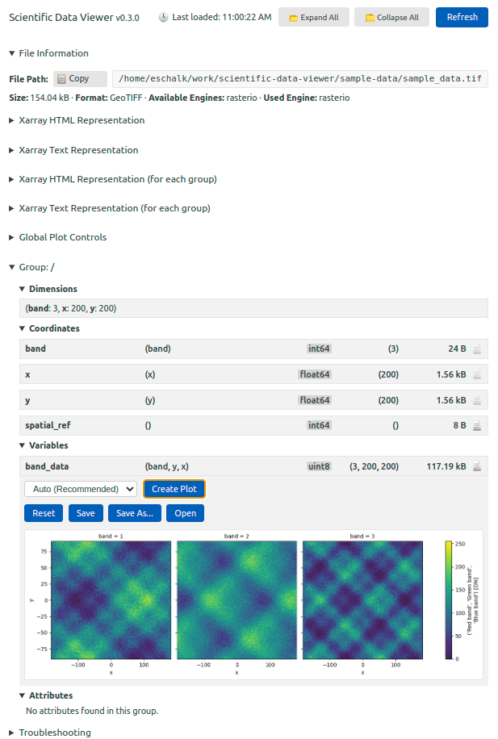
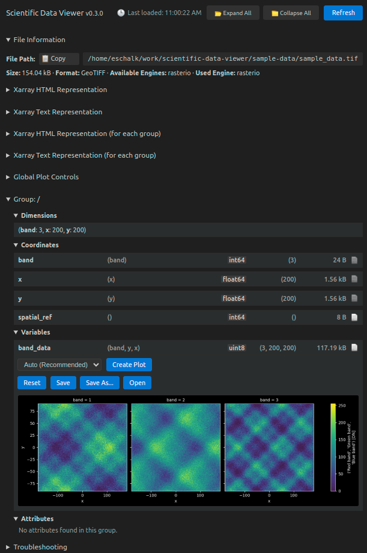
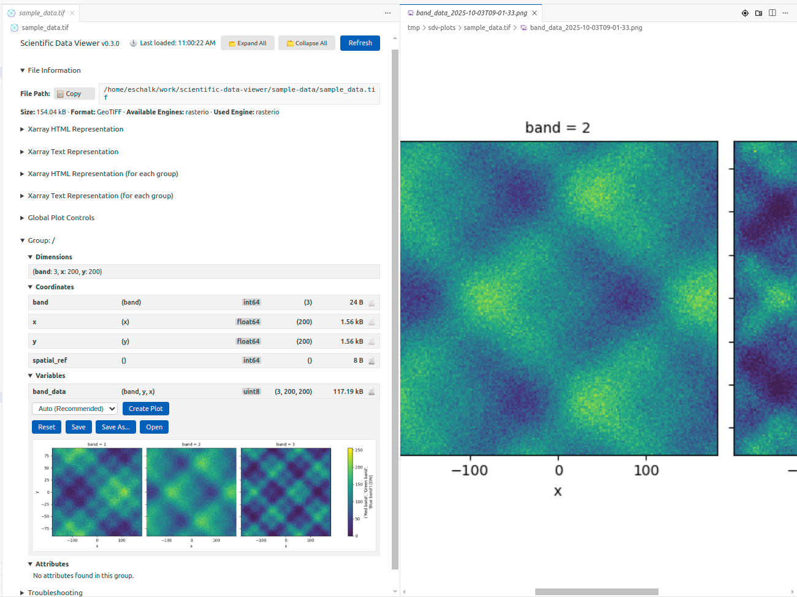
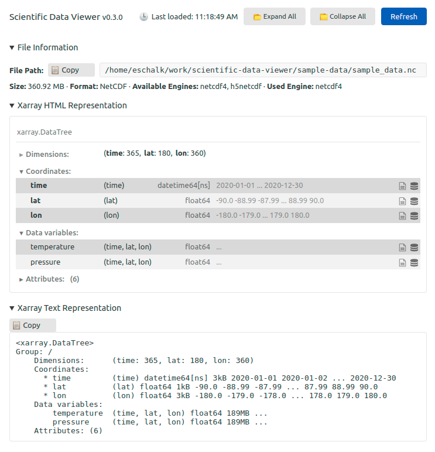
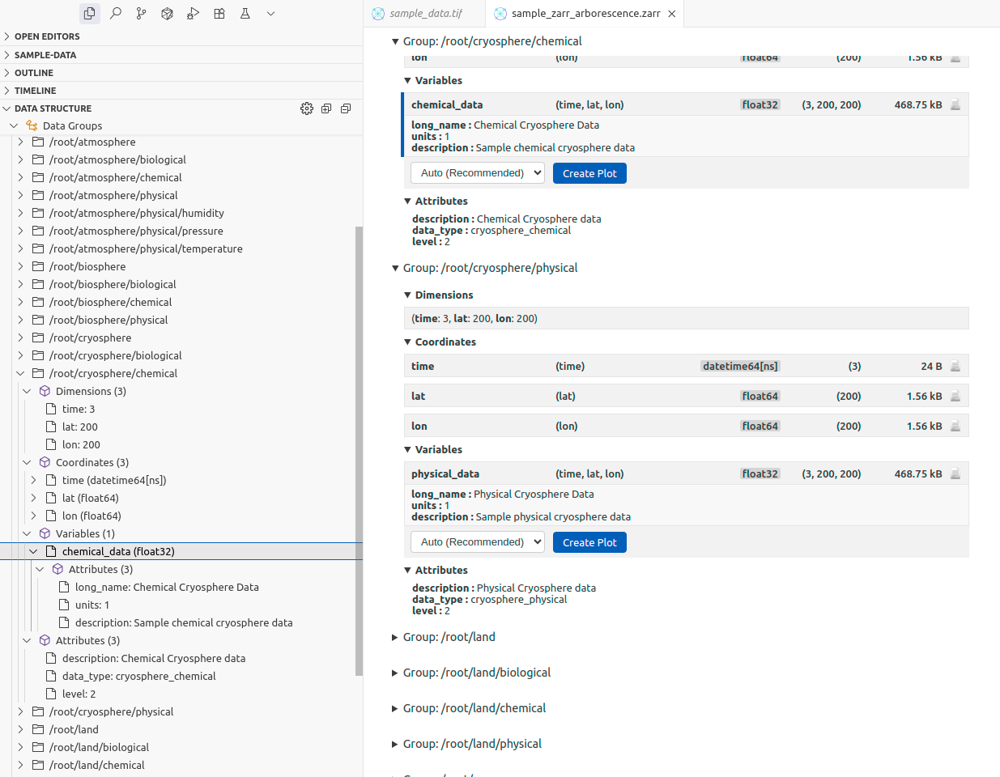

# Scientific Data Viewer - VSCode Extension

<div align="center">
  
</div>

An extension to explore the metadata of scientific data files within your IDE, including NetCDF, Zarr, HDF5, GRIB, GeoTIFF and JPEG-2000.

<div align="center">

**Current Version: v0.9.0** • [Release Notes](./docs/RELEASE_NOTES_0.9.0.md)

Available on:
[VSCode Marketplace](https://marketplace.visualstudio.com/items?itemName=eschalk0.scientific-data-viewer) • [Open VSX Registry](https://open-vsx.org/extension/eschalk0/scientific-data-viewer)

[Getting Started](https://github.com/etienneschalk/scientific-data-viewer/wiki/Getting-Started)

</div>

> **⚠️ Windows users (0.8.0 / 0.8.1):** Versions 0.8.0 and 0.8.1 have known issues on Windows (e.g. “Invalid response format”, “Python environment not ready”, [Issue #118](https://github.com/etienneschalk/scientific-data-viewer/issues/118)). **v0.8.2 attempts to fix this.** If you still see problems after updating to 0.8.2, use [version 0.7.0](https://marketplace.visualstudio.com/items?itemName=eschalk0.scientific-data-viewer) as a workaround (install an older version from the marketplace or download the VSIX from the [Releases](https://github.com/etienneschalk/scientific-data-viewer/releases) page).

## 🚀 Features

- **Multi-format Support**:

| Format     | File Extension             |
| ---------- | -------------------------- |
| NetCDF     | .nc, .netcdf, .nc4         |
| CDF (NASA) | .cdf                       |
| Zarr       | .zarr                      |
| HDF5       | .h5, .hdf5                 |
| GRIB       | .grib, .grib2, .grb, .grb2 |
| GeoTIFF    | .tif, .tiff, .geotiff      |
| JPEG-2000  | .jp2, .jpeg2000            |

- **Python Integration**: Automatic Python environment detection and management
- **File Tree Integration**: Right-click on supported files in the explorer to open them
- **Custom Editors**: Direct file opening with dedicated editors
- **Interactive Data Explorer**: Browse file structure, dimensions, variables, and attributes
- **Browse Variable Information**: View variable dimension names, data types, shapes, and memory usage
- **Basic Data Visualization**: Create plots and visualizations directly in VSCode **(experimental, best effort)**
- **Enhanced GeoTIFF Support**: Multi-band GeoTIFF files automatically convert bands to separate variables for improved readability and plotting
- **HTML Report Export**: Export complete data viewer content as self-contained HTML reports for sharing and documentation
- **Command Palette Integration**: Multiple commands for data viewer operations
- **Status Bar Integration**: Shows current Python interpreter status
- **Human-readable File Sizes**: Display file and variable sizes in appropriate units (B, kB, MB, GB, TB)
- **Easy Settings Access**: <kbd>Ctrl</kbd>+<kbd>Shift</kbd>+<kbd>P</kbd> ➜ _Scientific Data Viewer: Show Settings_
- **Error Handling**: Robust error handling with user-friendly messages
- **Experimental Features**: Configurable experimental features with clear warnings

## 📸 Screenshot Gallery

**Data Visualization and Plotting**

<div align="center">
  <a href="media/screenshots/light-tif-plot-0.3.0.png" target="_blank">
    
  </a>
  <p><em>Light theme: GeoTIFF data visualization with plotting capabilities</em></p>
</div>

<div align="center">
  <a href="media/screenshots/dark-tif-plot-0.3.0.png" target="_blank">
    
  </a>
  <p><em>Dark theme: GeoTIFF data visualization with plotting capabilities</em></p>
</div>

<div align="center">
  <a href="media/screenshots/light-tif-plot-opened-0.3.0.png" target="_blank">
    
  </a>
  <p><em>Light theme: GeoTIFF plot in opened/expanded state</em></p>
</div>

**Data Structure Exploration**

<div align="center">
  <a href="media/screenshots/light-nc-xarray-html-and-text-repr-0.3.0.png" target="_blank">
    
  </a>
  <p><em>Light theme: NetCDF file with xarray HTML and text representation</em></p>
</div>

<div align="center">
  <a href="media/screenshots/light-zarr-tree-view-focus-on-variable-0.3.0.png" target="_blank">
    
  </a>
  <p><em>Light theme: Zarr dataset tree view with variable focus</em></p>
</div>

## 📦 Installation

1. **Install from VSCode Marketplace**:
   - Open VSCode
   - Go to Extensions view (`Ctrl+Shift+X`)
   - Search for "Scientific Data Viewer"
   - Click Install

2. **Install required Python dependencies**: (prompted by extension)

   ```bash
   pip install xarray matplotlib
   ```

3. **Install optional Python dependencies**: (prompted by extension)

   ```bash
   pip install netCDF4 h5py rioxarray cfgrib zarr cdflib
   ```

4. **Open a supported file 🎉**

## ⚙️ Prerequisites

Before using this extension, you need either **Python 3.13** or **uv** installed on your system.

---

With **Python 3.13**:

The extension will prompt you to install the following packages if they are not available:

1. **Required Python packages**:
   - xarray
   - matplotlib
2. **Optional Python packages**:
   - netCDF4
   - h5py
   - rioxarray
   - cfgrib
   - zarr
   - cdflib (for NASA CDF files)

Note: Former Python versions may work, but it is not guaranteed nor supported.

---

With **uv**, the extension will create and manage its own python environment,
indluding the Python version 3.13.
The environment wil be stored in the extension dedicated storage, provided
by VSCode or Cursor.

## 🎯 Usage

### 🐍 Configuring Python Environment

The extension supports multiple ways to configure your Python environment:

1. **Python Extension Integration** (Default behaviour):
   - This mode delegates most of the work to the **Python extension**. Its installation is a requirement.
     - For VSCode users: [🔗 Python extension (VSCode Marketplace)](https://marketplace.visualstudio.com/items?itemName=ms-python.python)
     - For Cursor users: [🔗 Python extension (Open VSX Registry)](https://open-vsx.org/extension/ms-python/python)
   - Press <kbd>Ctrl</kbd>+<kbd>Shift</kbd>+<kbd>P</kbd> (open command palette)
   - Type "Python: Select Interpreter"
   - Choose your preferred Python environment
   - The extension will automatically detect it and use it

2. **Extension Virtual Environment (Semi-Standalone)**:
   - **Opt-in setting**:
     - Press <kbd>Ctrl</kbd>+<kbd>Shift</kbd>+<kbd>P</kbd> (open command palette)
     - Type "Scientific Data Viewer: Show Settings"
     - Check "Scientific Data Viewer > Python > Use Extension Own Environment"
   - **uv Required**:
     - Consult the documentation: [uv installation](https://docs.astral.sh/uv/getting-started/installation/')
     - If **uv** is installed and found: The extension creates its own isolated environment once the setting enabled, including Python 3.13 installation
     - If uv is not available, falls back to Python extension default behavior
   - **Manage Extension Environment**:
     - Press <kbd>Ctrl</kbd>+<kbd>Shift</kbd>+<kbd>P</kbd> (open command palette)
     - Type "Scientific Data Viewer: Manage Extension Virtual Environment"
     - Choose a command: create, update, delete, view information
   - **Benefits of this approach**:
     - **Python 3.13**: Uses uv to install and use Python 3.13 for optimal performance
     - **Self-Contained**: Works without external Python environment setup
     - **Isolated**: Won't interfere with your other projects
     - **Storage**: Stored in VSCode's extension storage space

### 📂 Opening Data Files

1. **Click on file from File Explorer**:
   - Click on any supported file in the File Explorer
   - File opens directly in the Scientific Data Viewer
   - Command "View: Split Editor" is supported

2. **Drag and drop from File Explorer**
   - Drag and drop any supported file (or folder)
   - File (or folder) opens directly in the Scientific Data Viewer
     - Multiple files (or folders) can be opened at once if they are selected
   - Command "View: Split Editor" is supported

3. **Context menu from File Explorer**:
   - Right-click on any supported file (or folder)
   - Select "Open Scientific Data Viewer" for single file or folder
   - Select "Open Scientific Data Viewer for Selection" to open multiple selected multiple files or folders
   - Command "View: Split Editor" is NOT supported

4. **From command palette**:
   - Press <kbd>Ctrl</kbd>+<kbd>Shift</kbd>+<kbd>P</kbd>
   - Type "Open Scientific Data Viewer" (or "Open Scientific Data Viewer (Folder)")
   - Select a file (or folder) from the file picker
     - Multiple files (or folders) can be opened at once if they are selected
   - Command "View: Split Editor" is NOT supported

Note: the only current way to get access to the split editor for Zarr folders is drag and drop.

### 🔬 Exploring Data

You can explore the data via the editor itself, or via the _Data Structure_ tree view displayed on the VSCode's left pane.

The data viewer editor shows:

- **File Information**: Path, size, format, and basic metadata
- **Xarray HTML and Text Representations**: Users that are used to xarray will be happy to see the well-known views. Uses DataTree or Dataset representation, depending on the file format.
- **Xarray HTML and Text Representations (for each group)**: Relevant for multi-group datasets. Nested groups are flattened (using a sorted [`DataTree.to_dict()`](https://docs.xarray.dev/en/latest/generated/xarray.DataTree.to_dict.html)). Dataset representations are always used for groups.
- **Global Plot Controls** (:warning: EXPERIMENTAL): Use at your own risk. It will trigger plotting operations for all available variables. It is not optimized at all, and usage is not really recommended.
- **Groups**: The extension's data representation proposal. The view is inspired by the xarray HTML representation, with additional plotting controls. Feature parity is not reached yet as no sample data is currently displayed.
  - **Dimensions**: Dataset dimensions and their sizes
  - **Coordinates**: All coordinates with their types, shapes, dimension names, and memory usage. Attributes can be revealed when clicking on a coordinate..
  - **Variables**: All data variables with their types, shapes, dimension names, and memory usage. Attributes can be revealed when clicking on a variable.
    - **Plot Controls** (:warning: EXPERIMENTAL): "Create Plot" button for a variable, that tries the best effort to produce a plot of the variable using matplotlib. Currently, only an "auto" (best effort) plot mode is supported.
  - **Attributes**: Show group's attributes.

### 📐 Dimension Slices

Dimension Slices let you subset data by dimension index or slice before plotting. They are available in **Global Plot Controls** (dimensions merged from all groups) and, when enabled, in each group’s **Group Plot Controls**.

- **Where to find it**: In the plot controls area, look for the **Dimension Slices** section. Each dimension of the dataset (or group) has a text input.
- **Slice syntax** (Python-style):
  - **Single index**: `130` — use one position along that dimension.
  - **Range**: `100:120` — from index 100 up to (but not including) 120.
  - **Range with step**: `0:24:2` — from 0 to 24 in steps of 2 (e.g. every other time step).
- Slices are applied as xarray’s `isel()` before plotting. Invalid slice strings produce a clear error.
- **Facet row / Facet col**: Use the dropdowns in the same section to choose which dimension drives rows and columns in faceted plots (e.g. 3D/4D data with multiple panels).
- **col_wrap**: Optional positive integer (next to facet row/col) to limit the number of columns in the faceted grid (xarray `col_wrap` kwarg).
- **x, y, hue**: Optional plot kwargs (see [xarray plotting](https://docs.xarray.dev/en/latest/user-guide/plotting.html)): choose a dimension or coordinate for the **x**-axis, **y**-axis, or **hue** (e.g. multiple lines). Same dropdown options as facet row/col.
- **x increase / y increase**: Checkboxes to control axes direction (xarray `xincrease`/`yincrease`; uncheck to reverse an axis).
- **Aspect / Size**: Optional integer inputs for figure size (xarray: `figsize = (aspect * size, size)` in inches).
- **Robust**: When checked, uses the 2nd and 98th percentiles of the data for color limits so outliers do not dominate the color scale (xarray [Robust](https://docs.xarray.dev/en/latest/user-guide/plotting.html#Robust)).
- **Bins**: For histogram-style plots, you can set the number of bins in the Dimension Slices row.

The Dimension Slices section includes a link to the [xarray plotting guide](https://docs.xarray.dev/en/latest/user-guide/plotting.html) for reference.

**Global vs. Group (inheritance)**
The extension uses **inheritance** per field: for each plot parameter, the **group** value is used when set (non-empty), otherwise **global** is used. So the two can be mixed (e.g. group's dimension slices with global's facet row when the group left facet at "None"). Empty or "None" in group selectors (facet row/col, plot x/y/hue, cmap) falls back to global. **Only dimension slices are atomic**: they form one set of inputs (one per dimension); we use either the whole group's dimension-slice set or the whole global's—we do not merge dimension-by-dimension. So one change in a group's dimension slice inputs means that group's full set is used and global's dimension slices are ignored for that group; all other fields (facet row/col, plot x/y/hue, colWrap, aspect, size, robust, cmap, bins, checkboxes) inherit per field (group when set, else global).

**Feature flags**: Four settings control whether each block is shown. **Global Dimension Slices** and **Group Dimension Slices** are **on by default**; **Global Time Controls** and **Group Time Controls** are **off by default** (use Dimension Slices for time instead, e.g. `0:24:2`). You can turn any block on or off in [Settings](#️-settings) under **Feature Flags**.

### 🎮 Available Commands

Access these commands via the Command Palette (<kbd>Ctrl</kbd>+<kbd>Shift</kbd>+<kbd>P</kbd>):

| Command                                                        | Description                                                                     |
| -------------------------------------------------------------- | ------------------------------------------------------------------------------- |
| `Scientific Data Viewer: Open Scientific Data Viewer`          | Opens the Scientific Data Viewer for a file                                     |
| `Scientific Data Viewer: Open Scientific Data Viewer (folder)` | Opens the Scientific Data Viewer for a folder (eg for Zarr)                     |
| `Scientific Data Viewer: Refresh Python Environment`           | Refreshes the Python environment used by the extension                          |
| `Scientific Data Viewer: Show Extension Logs`                  | Opens the extension's log output for debugging                                  |
| `Scientific Data Viewer: Show Settings`                        | Opens the extension settings                                                    |
| `Scientific Data Viewer: Open Developer Tools`                 | Opens the developer tools for the webview                                       |
| `Scientific Data Viewer: Manage Extension Virtual Environment` | View status and manage the extension environment (create, update, delete, info) |
| `Scientific Data Viewer: Export Webview Content`               | Export the active Scientific Data Viewer as a self-contained HTML report        |
| `Scientific Data Viewer: Toggle Dev Mode`                      | Quickly enable/disable dev mode without navigating settings                     |

### 🖱️ Context Menu Commands

Right-click on supported file types in the Explorer to access:

- **Open in Data Viewer** - Opens the file in the Scientific Data Viewer

### 🖼️ Export Webview Content

The extension allows you to export complete data viewer content as self-contained HTML reports:

1. **Using the Export Button**:
   - Open a scientific data file in the Scientific Data Viewer
   - Click the export button (🖼️) in the header controls
   - Choose a location and filename for the HTML report
   - The report will be generated and you can choose to open it or reveal it in explorer

2. **Using the Command Palette**:
   - Press <kbd>Ctrl</kbd>+<kbd>Shift</kbd>+<kbd>P</kbd> (open command palette)
   - Type "Scientific Data Viewer: Export Webview Content"
   - Choose a location and filename for the HTML report

**Report Contents**:

- Complete file information (path, size, format, engines)
- Xarray HTML and text representations
- Data structure (dimensions, coordinates, variables, attributes)
- Technical information (Python path, extension configuration, versions)
- All content is self-contained with embedded CSS and JavaScript
- Professional layout with copy buttons for easy data extraction

**Use Cases**:

- Share data analysis results with colleagues
- Create documentation for datasets
- Archive data viewer sessions
- Generate reports for presentations or publications

## ⚙️ Settings

The extension can be configured through VSCode settings:

**General Settings**

- **`scientificDataViewer.maxFileSize`**
  - (type: `number`, default: `1000000000000`)
  - Maximum file size in MB to load
- **`scientificDataViewer.defaultView`**
  - (type: `string`, default: `"default"`)
  - Default view mode for data display.
- **`scientificDataViewer.matplotlibStyle`**
  - (type: `string`, default:`""` (empty string))
  - Matplotlib plot style for data visualizations. If empty, automatically detects VSCode theme and applies appropriate style (light theme → `default`, dark theme → `dark_background`). If set, overrides automatic detection. **Examples:** `default`, `dark_background`, `seaborn`, `ggplot`, or any valid matplotlib style name.
- **`scientificDataViewer.smallVariableBytes`**
  - (type: `number`, default: `1000`)
  - Maximum size in bytes for variables and coordinates to have their values loaded and displayed in the UI (scalar and small array display, [Issue #102](https://github.com/etienneschalk/scientific-data-viewer/issues/102)). Variables/coordinates at or below this size get a **display_value** in the variable/coordinate details. **If set to `0`, the whole small-value display feature (Issue #102) is disabled** and no variables/coordinates will show loaded values.
- **`scientificDataViewer.smallValueDisplayMaxLen`**
  - (type: `number`, default: `500`)
  - Maximum character length for the string representation of small variable/coordinate values. Longer representations are truncated with `"..."`. Only used when **`scientificDataViewer.smallVariableBytes`** is greater than 0.

**🐍 Virtual Environment Settings**

The extension includes specific settings for virtual environment management:

- **`scientificDataViewer.python.overridePythonInterpreter`**
  - (string, default: `""`)
  - Override the Python interpreter path (takes precedence over all other options). If set, this will take precedence over the extension's own virtual environment, Python extension's interpreter, and any auto-detected environments.
- **`scientificDataViewer.python.useExtensionOwnEnvironment`**
  - (boolean, default: `false`)
  - Use the extension's own virtual environment instead of the Python extension's interpreter. When enabled, the extension will create and use its own isolated virtual environment stored in VSCode's extension storage. **Requires `uv` to be installed** - if uv is not available, the extension will fall back to using the Python extension's interpreter. The extension will automatically use `uv` to install Python 3.13 and create the environment with all required packages.

**🚩 Feature Flags**

The extension includes configuration options that act as feature flags to control specific behaviors:

- **`scientificDataViewer.allowMultipleTabsForSameFile`**
  - (type: `boolean`, default: `false`)
  - ⚠️ **Experimental** - Allow opening multiple tabs for the same file. When enabled, each 'Open in Data Viewer' action creates a new tab. When disabled (default), focuses on existing tab if file is already open.
- **`scientificDataViewer.devMode`**
  - (type: `boolean`, default: `false`)
  - Enable development mode. When enabled, automatically runs 'Show Extension Logs' and 'Open Developer Tools' commands when a scientific data file is opened. Also reloads the webview script and CSS for faster development feedback loops.
- **`scientificDataViewer.convertBandsToVariables`**
  - (type: `boolean`, default: `true`)
  - Convert bands of GeoTIFF rasters to variables for better readability. When enabled, multi-band GeoTIFF files (.tif, .tiff, .geotiff) will have their bands converted to separate variables instead of a single 3D DataArray. This improves plotting capabilities and data structure visualization by treating each band as an individual variable.

**Plot controls (Global and Group)**

- **`scientificDataViewer.globalTimeControls`**
  - (type: `boolean`, default: `false`)
  - Show **Global Time Controls** (datetime variable, start/end time) in the plot area. When off (default), use Dimension Slices to subset time (e.g. `0:24:2`).
- **`scientificDataViewer.globalDimensionSlices`**
  - (type: `boolean`, default: `true`)
  - Show **Global Dimension Slices** (dimension inputs, facet row/col, x/y/hue, bins) with dimensions merged from all groups.
- **`scientificDataViewer.groupTimeControls`**
  - (type: `boolean`, default: `false`)
  - Show **Group Time Controls** per group (datetime, start/end) in each group’s Plot Controls section.
- **`scientificDataViewer.groupDimensionSlices`**
  - (type: `boolean`, default: `true`)
  - Show **Group Dimension Slices** per group (dimension inputs, facet row/col, x/y/hue, bins) in each group’s Plot Controls section. Per-field inheritance: group value when set (non-empty), else global. Only dimension slices are atomic (whole group set or whole global).

## 🔧 Troubleshooting

### ⚠️ Common Issues

1. **Windows: extension not working (0.8.0 / 0.8.1)**:
   - Versions 0.8.0 and 0.8.1 have [known issues](https://github.com/etienneschalk/scientific-data-viewer/issues/118) on Windows (e.g. “Invalid response format”, “Python environment not ready”). **v0.8.2 attempts to fix this.** If the problem persists after updating to 0.8.2, use [version 0.7.0](https://github.com/etienneschalk/scientific-data-viewer/releases/tag/v0.7.0) as a workaround.

2. **Python not found**:
   - Ensure Python is installed and in your PATH
   - Use the "Python: Select Interpreter" command to manually set the path
   - Consider using the extension's own virtual environment for a self-contained solution

3. **uv not available**:
   - Consult the documentation: [uv installation](https://docs.astral.sh/uv/getting-started/installation/')
   - Install uv manually: `pip install uv` or `curl -LsSf https://astral.sh/uv/install.sh | sh`
   - If uv is not installed, the extension will fall back to using the Python extension's interpreter

4. **Missing packages**:
   - Install required packages: `pip install xarray matplotlib`
   - Install per-format packages: `pip install netCDF4 zarr h5py numpy rioxarray`
   - Or let the extension install them automatically (prompt when opening a file)

5. **Large files not loading**:
   - Increase the `maxFileSize` setting
   - Consider using data slicing for very large datasets

6. **Permission errors**:
   - Ensure the extension has permission to read your data files
   - Check file permissions and VSCode workspace settings

### 💬 Getting Help

- **Consult the Troubleshooting section**: Available at the end of the opened file. Copy buttons are present to help creating an issue.
- **Check the logs**: <kbd>Ctrl</kbd>+<kbd>Shift</kbd>+<kbd>P</kbd> (Command Palette) then type "Scientific Data Viewer: Show Extension Logs"
- **Report issues**: [Create an issue (🐛 Bug Report) on the GitHub repository](https://github.com/etienneschalk/scientific-data-viewer/issues/new?template=bug_report.yml)
- **Ask questions**: [Create an issue (❓ Question / Discussion) on the GitHub repository](https://github.com/etienneschalk/scientific-data-viewer/issues/new?template=question.yml)
- **I would like a specific feature**: [Create an issue (✨ Feature Request) on the GitHub repository](https://github.com/etienneschalk/scientific-data-viewer/issues/new?template=feature_request.yml) to suggest a new feature or enhancement for the Scientific Data Viewer extension

## 🤝 Contributing

We welcome contributions! Please see our [Contributing Guidelines](CONTRIBUTING.md) for details.

**Development Setup**

1. Fork the repository
2. Create a feature branch
3. Make your changes
4. Add tests if applicable
5. Submit a pull request

## 🛠️ Development

See the [Development Guide](docs/DEVELOPMENT.md)

## 📄 License

This project is licensed under the MIT License - see the [LICENSE](LICENSE) file for details.

## 🙏 Acknowledgments

- Inspired by the [NetCDF Viewer](https://github.com/rmcd-mscb/netcdf-viewer) extension
- Built with [xarray](https://xarray.pydata.org/) for scientific data processing
- Uses [VSCode Extension API](https://code.visualstudio.com/api) for integration

## 📁 Project Structure

**Disclaimer**: The information below is provided for reference purposes only and may be outdated. Please refer to actual source code for the most current information.

```
scientific-data-viewer/
├── src/                                    # TypeScript source code
│   ├── extension.ts                        # Main extension entry point and command registration
│   ├── ScientificDataEditorProvider.ts     # Custom editor provider for supported file types
│   ├── DataViewerPanel.ts                  # Webview panel for data visualization and lifecycle
│   ├── StatusBarItem.ts                    # Status bar item (Python interpreter status)
│   ├── types.ts                            # Shared TypeScript types (responses, config, etc.)
│   ├── package-types.ts                    # Package manifest / dependency type definitions
│   ├── common/                             # Shared utilities, config, and error handling
│   │   ├── config.ts                       # Extension configuration (settings, feature flags)
│   │   ├── Logger.ts                       # Logging utilities (extension output channel)
│   │   ├── utils.ts                        # General helpers (e.g. quoteIfNeeded, formatConfigValue)
│   │   ├── vscodeutils.ts                  # VSCode API helpers (show message, open settings)
│   │   ├── HealthcheckManager.ts           # Health check and package availability coordination
│   │   └── ErrorBoundary.ts                # Error boundary for graceful error handling
│   ├── panel/                              # Webview panel UI, theme, and message passing
│   │   ├── HTMLGenerator.ts                # HTML generation for data viewer content (groups, variables, plot controls)
│   │   ├── UIController.ts                  # UI controller: handles messages, plot requests, export
│   │   ├── ThemeManager.ts                  # Theme detection and webview styling (light/dark)
│   │   ├── JavaScriptGenerator.ts          # Inline script generation for webview bootstrap
│   │   ├── CSSGenerator.ts                 # CSS generation for webview (e.g. dimension slices)
│   │   ├── communication/                  # Message passing between webview and extension
│   │   │   ├── MessageBus.ts               # Message bus for postMessage / onDidReceiveMessage
│   │   │   └── MessageTypes.ts              # Type definitions for request/response messages
│   │   ├── state/                          # Panel-level application state
│   │   │   └── AppState.ts                  # Global application state (data, loading, errors)
│   │   └── webview/                         # Webview static assets (bundled into extension)
│   │       ├── styles.css                  # Webview styles (layout, variables, plot controls)
│   │       └── webview-script.js           # Webview client script (tree, plots, export, copy)
│   ├── python/                             # Python environment and data processing
│   │   ├── DataProcessor.ts                # Calls get_data_info.py for info and plot; builds CLI args
│   │   ├── PythonManager.ts                # Python interpreter resolution, spawn, package check, venv
│   │   ├── ExtensionVirtualEnvironmentManager.ts    # uv-based extension-owned venv (create, update, delete)
│   │   ├── ExtensionVirtualEnvironmentManagerUI.ts  # UI commands for managing extension venv
│   │   └── officialPythonExtensionApiUtils.ts       # Integration with official Python extension API
│   └── outline/                            # Outline / tree view in sidebar
│       ├── OutlineProvider.ts              # Outline tree data provider (file structure)
│       └── HeaderExtractor.ts              # Extracts headers/sections for outline from viewer content
├── python/                                 # Python scripts run by the extension (subprocess)
│   ├── get_data_info.py                    # CLI: info (metadata, variables, coords) and plot (matplotlib)
│   ├── check_package_availability.py       # Package availability check (xarray, matplotlib, etc.)
│   ├── create_sample_data.py              # Generate sample data files (NetCDF, Zarr, GeoTIFF, etc.)
│   ├── test_datetime_edge_cases.py        # Pytest: datetime parsing and filtering edge cases
│   ├── test_dimension_slices_and_small_value.py   # Pytest: dimension slices and small value display
│   ├── tests.ipynb                        # Jupyter notebook for manual testing
│   ├── issue_104_cdf_file.ipynb           # Notebook for CDF-related testing
│   └── remote_dataset.ipynb               # Notebook for remote dataset experiments
├── test/                                   # Extension tests (Mocha + VS Code test runner)
│   ├── runTest.ts                          # Test runner entry (launch VS Code with extension, run suite)
│   └── suite/                              # Test suites
│       ├── index.ts                        # Suite registration and exports
│       ├── extension.test.ts               # Extension activation and commands
│       ├── integration.test.ts             # Integration tests (e.g. open file, get data)
│       ├── dataViewerPanel.test.ts         # DataViewerPanel tests
│       ├── dataProcessor.test.ts           # DataProcessor tests
│       ├── pythonManager.test.ts           # PythonManager tests
│       ├── logger.test.ts                   # Logger tests
│       ├── config.test.ts                  # Config tests
│       ├── datetimeEdgeCases.test.ts       # Datetime edge case tests
│       ├── communication/                  # Message bus and types tests
│       │   └── MessageBus.test.ts
│       ├── error/                          # Error boundary tests
│       │   └── ErrorBoundary.test.ts
│       ├── state/                           # App state tests
│       │   └── AppState.test.ts
│       ├── outline/                         # Outline provider tests
│       │   ├── OutlineProvider.test.ts
│       │   └── HeaderExtractor.test.ts
│       └── ui/                              # UI generator tests
│           ├── HTMLGenerator.test.ts
│           ├── UIController.test.ts
│           └── CSSGenerator.test.ts
├── sample-data/                            # Sample data files for development and testing
│   ├── sample_data.nc                      # NetCDF sample (large; used for many tests)
│   ├── sample_data.h5                      # HDF5 sample
│   ├── sample_data.grib                    # GRIB sample
│   ├── sample_data.grib2                   # GRIB2 sample
│   ├── sample_data.tif                     # GeoTIFF sample
│   ├── sample_data.jp2                     # JPEG-2000 sample
│   ├── sample_data.cdf                     # NASA CDF sample
│   ├── sample_data.nc4                     # NetCDF-4 sample
│   ├── sample_data.netcdf                  # NetCDF (alternate extension)
│   ├── sample_data.hdf5                    # HDF5 (alternate extension)
│   ├── sample_data.tiff                    # GeoTIFF (alternate extension)
│   ├── sample_data.geotiff                 # GeoTIFF (alternate extension)
│   ├── sample_data.jpeg2000                # JPEG-2000 (alternate extension)
│   ├── sample_data_multiple_groups.nc      # NetCDF with multiple groups
│   ├── sample_data_many_vars.nc            # NetCDF with many variables
│   ├── sample_data_no_attributes.nc        # NetCDF without attributes
│   ├── sample_data_long_variable_names.nc  # NetCDF with long variable names
│   ├── sample_data_complex_long_names.nc   # NetCDF with complex long names
│   ├── sample_data_many_encoding.nc        # NetCDF with various encodings
│   ├── sample_large_4d_data.nc             # Large 4D NetCDF
│   ├── sample_multiband.tif               # Multi-band GeoTIFF
│   ├── sample data with spaces.nc          # NetCDF in path with spaces (Issue #125)
│   ├── broken_file.nc                      # Broken/corrupt files for error handling tests
│   ├── broken_file.h5
│   ├── broken_file.grib
│   ├── broken_file.jp2
│   ├── broken_file.tif
│   ├── broken_file.zarr/
│   ├── broken_file.safe/                    # (e.g. Sentinel SAFE placeholder)
│   ├── sample_zarr_arborescence.zarr/      # Zarr with tree (root/ocean, land, etc.)
│   ├── sample_zarr_inherited_coords.zarr/   # Zarr with inherited coordinates
│   ├── sample_zarr_nested_groups_from_datatree.zarr/
│   ├── sample_zarr_nested_groups_from_zarr.zarr/
│   ├── sample_zarr_single_group_from_dataset.zarr/
│   ├── disposable/                          # Disposable test files (e.g. disposable_file_00.nc, .zarr)
│   ├── nested/                             # Nested sample (e.g. sample_data.tif)
│   ├── temporal-datasets/                  # Temporal dataset samples
│   └── sdv-plots/                          # Generated plot outputs (from extension)
├── docs/                                   # Documentation
│   ├── DEVELOPMENT.md                      # Development guide (setup, build, test)
│   ├── PUBLISHING.md                       # Publishing guide (marketplace, Open VSX)
│   ├── QUICKSTART.md                       # Quick start guide
│   ├── TECHNICAL_ARCHITECTURE.md            # Technical architecture
│   ├── ARCHITECTURE_IMPROVEMENTS.md        # Architecture improvement notes
│   ├── test-extension.md                   # Extension testing guide
│   ├── PRE_COMMIT_SETUP.md                 # Pre-commit hooks setup
│   ├── GITHUB_ACTIONS_SETUP.md             # CI / GitHub Actions setup
│   ├── WEBVIEW_EXPORT_CONTENT.md           # Webview export (HTML report) documentation
│   ├── IMPLEMENTATION_PROPOSAL_ISSUE_106.md # Implementation proposals
│   ├── RELEASE_NOTES_0.3.0.md … 0.9.0.md   # Release notes per version
│   ├── RELEASE_CHECKLIST_0.7.0.md          # Release checklist example
│   └── PR_SUMMARY_*.md                     # Pull request summaries
├── media/                                  # Media assets
│   ├── icon.png                            # Extension icon (PNG)
│   ├── icon.svg                            # Extension icon (SVG)
│   ├── icon_dark_bg.svg                    # Icon variant (dark background)
│   ├── icon_viridis_bold_monochromatic.svg # Icon variant (viridis, monochrome)
│   └── screenshots/                        # Screenshots for README / marketplace
│       ├── light-tif-plot-0.3.0.png
│       ├── dark-tif-plot-0.3.0.png
│       ├── light-tif-plot-opened-0.3.0.png
│       ├── light-nc-xarray-html-and-text-repr-0.3.0.png
│       └── light-zarr-tree-view-focus-on-variable-0.3.0.png
├── notebooks/                              # Jupyter notebooks (e.g. issue exploration)
│   └── issue-0117-select-and-slice-before-plotting.ipynb
├── out/                                    # Compiled JavaScript output (tsc; do not commit)
│   ├── src/                                # Compiled TypeScript
│   └── test/                               # Compiled tests
├── node_modules/                           # Node.js dependencies (npm install)
├── package.json                            # Extension manifest, scripts, dependencies
├── package-lock.json                       # Dependency lock file
├── tsconfig.json                           # TypeScript configuration
├── tsconfig.pre-commit.json                 # TypeScript config for pre-commit (e.g. type check)
├── pyproject.toml                         # Python project config (ruff, pytest)
├── .eslintrc.js                            # ESLint configuration
├── ensure.sh                               # Environment / dependency ensure script
├── setup.sh                                # Setup script
├── publish.sh                              # Publishing script
├── test-publication-readiness.js            # Publication readiness test (optional)
├── README.md                               # This file
├── CONTRIBUTING.md                         # Contribution guidelines
├── CHANGELOG.md                            # Version history
└── LICENSE                                 # MIT License
```
