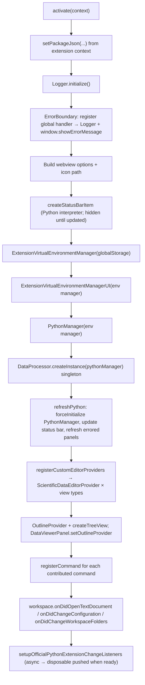

# Current State of the project - April 2026

This note is a **high-level map** of the Scientific Data Viewer VS Code extension as of April 2026. Much of the implementation predates recent refactors: the extension host side mixes orchestration, I/O, and UI wiring, while the webview carries a very large client script. Treat this document as an **onboarding aid**, not a specification.

---

## What the extension does

The extension opens scientific file formats (NetCDF, HDF5, Zarr, GRIB, GeoTIFF, JPEG 2000, and related extensions) in a **webview-based viewer**. It uses a **Python toolchain** (typically **xarray** and format-specific backends) to introspect datasets and render plots. Users can open files via **custom editors** registered in `package.json`, or via **commands** that create standalone `WebviewPanel`s.

---

## Entry point: `extension.ts`

`activate` is the single authoritative bootstrap. `deactivate` tears down long-lived resources.

### Activation sequence (Mermaid)

The diagram below is a simplified ordering; some steps enqueue async work (for example, listening to the official Python extension) that finishes shortly after activation continues.

### Two ways a viewer panel appears

1. **Custom editor** — VS Code calls `ScientificDataEditorProvider.resolveCustomEditor`, which waits for `PythonManager.waitForInitialization()` (best effort), then `DataViewerPanel.createFromWebviewPanel(...)` with the panel VS Code already created.
2. **Command-driven** — Handlers such as `waitThenCreateOrRevealPanel` wait for Python init, then `DataViewerPanel.createOrReveal(...)`, which may create a new `WebviewPanel` or focus an existing one depending on settings.

### Deactivation

`deactivate` aborts active Python processes via `DataProcessor` / `PythonManager`, clears the static panel map on `DataViewerPanel`, disposes `ErrorBoundary`, and shuts down `Logger`.

---

## Repository layout (extension-relevant)

| Area                  | Role                                                                                           |
| --------------------- | ---------------------------------------------------------------------------------------------- |
| `src/extension.ts`    | Activation, command registration, workspace listeners, Python refresh orchestration            |
| `src/*.ts` (root)     | Core types (`types.ts`), `DataViewerPanel`, `ScientificDataEditorProvider`, `StatusBarItem`    |
| `src/common/`         | Config keys, logging, VS Code helpers, errors, healthcheck, small utilities                    |
| `src/python/`         | Interpreter selection, uv-backed optional env, subprocess execution, `DataProcessor` → scripts |
| `src/panel/`          | Webview HTML/CSS/JS assembly, `UIController`, `MessageBus`, `AppState`, theming                |
| `src/panel/webview/`  | **`webview-script.js`** (large UI client), **`styles.css`** — read at runtime by generators    |
| `src/outline/`        | Sidebar outline tree and header derivation                                                     |
| `python/` (repo root) | **`get_data_info.py`** merged CLI (`info` / `plot` modes) and auxiliary scripts/notebooks      |
| `test/`               | Mocha-based tests (`**.test.js`), bootstrapped via `test/suite/index.ts`                       |
| `package.json`        | `activationEvents`, `contributes.commands`, custom editors, languages, views                   |

---

## Modules and how they interact

### Extension orchestration (`extension.ts` + `common/`)

- **`common/config.ts`** — Central place for setting keys, command IDs, and typed accessors used across the extension.
- **`common/vscodeutils.ts`** — Display name, version, supported extensions from `package.json`, dialogs, and shared message helpers.
- **`common/Logger.ts`** — Output channel logging; dev workflows often pair this with webview developer tools.
- **`common/ErrorBoundary.ts`** — Per-component and global error hooks; `UIController` registers a named handler that surfaces errors into the webview via `MessageBus`.
- **`common/HealthcheckManager.ts`** — On-demand diagnostic report (panels, Python, config, etc.); invoked from the healthcheck command.
- **`common/utils.ts`**, **`package-types.ts`** — Small shared helpers and structural types for package metadata.

**Interaction:** `extension.ts` wires configuration listeners and commands to `PythonManager`, `DataViewerPanel`, `OutlineProvider`, and `HealthcheckManager`. `refreshPython` is the main “reconcile environment + UI” path after config or workspace changes.

### Python stack (`src/python/` + root `python/`)

- **`ExtensionVirtualEnvironmentManager`** — Manages an optional **extension-owned** environment (uv-based) under global storage.
- **`ExtensionVirtualEnvironmentManagerUI`** — User-facing flow for managing that environment (command-driven).
- **`PythonManager`** — Resolves interpreter (override setting, extension env, Microsoft Python extension, or system), validates/installs dependency sets, spawns scripts, tracks and aborts child processes (important for long plot operations).
- **`officialPythonExtensionApiUtils`** — Optional integration with the Python extension for faster interpreter-change detection.
- **`DataProcessor`** — Singleton facade used everywhere host-side needs data: runs `get_data_info.py` with `info` or `plot` subcommands, passes settings (thresholds, matplotlib style, plot options) as CLI args, returns typed results aligned with `types.ts`.

**Interaction:** `extension.ts` constructs `PythonManager` once and passes it into `DataProcessor.createInstance`. `ScientificDataEditorProvider` and `UIController` both depend on `DataProcessor.getInstance()` (implicitly) for script execution. The webview never runs Python; it requests work through `MessageBus` → `UIController` → `DataProcessor`.

### Viewer panel (`DataViewerPanel.ts`)

- Owns a static **`Map` of live panels**, `getActivePanel`, `refreshPanelsWithErrors` (used after Python refresh), and a static reference to **`OutlineProvider`** set at startup.
- Constructs **`UIController`** with callbacks that flip a local `_hasError` flag and trigger outline updates when the panel becomes active (`onDidChangeViewState`).
- **`createOrReveal`** vs **`createFromWebviewPanel`** unify command-opened and custom-editor tabs.

**Interaction:** Commands in `extension.ts` resolve to a `DataViewerPanel` instance when they need to scroll (`emitCommandScrollToHeader`) or export webview content. The outline’s “scroll to header” command looks up the panel by id from `OutlineProvider.getCurrentPanelId()`.

### Panel / webview host side (`src/panel/`)

- **`UIController`** — Heart of host↔webview bridging: creates **`StateManager`**, **`MessageBus`**, subscribes to state, implements request handlers (`getDataInfo`, `createPlot`, `abortPlot`, save/open plot, `refresh`, `exportWebview`, `updateHeaders`, notifications, etc.), calls **`DataProcessor`**, updates HTML via **`HTMLGenerator`**, and coordinates with **`ThemeManager`**.
- **`communication/MessageBus.ts`** + **`MessageTypes.ts`** — Typed request/response/event messages over `webview.postMessage` / `onDidReceiveMessage`.
- **`HTMLGenerator.ts`** — Composes the document shell; inlines CSS from **`CSSGenerator`** and JS from **`JavaScriptGenerator`**.
- **`CSSGenerator` / `JavaScriptGenerator`** — Read `src/panel/webview/styles.css` and `webview-script.js` from disk (with reload in dev mode when enabled), so the running webview is largely **one HTML blob** with embedded assets.
- **`state/AppState.ts`** — Reducer-style state for the current file, loaded metadata, UI selections, and cached extension config snapshots pushed to the webview.

**Interaction:** The webview script sends requests; `MessageBus` dispatches to `UIController` methods; results and events flow back to update DOM/state in the iframe. Plotting and file introspection always round-trip through Python on the extension host.

### Outline (`src/outline/`)

- **`OutlineProvider`** — `TreeDataProvider` for the contributed outline view; stores headers per panel id, supports expand/collapse state, and attaches **`CMD_SCROLL_TO_HEADER`** to items.
- **`HeaderExtractor`** — Builds a hierarchical **`HeaderItem`** tree from loaded data metadata (and related helpers for ids); used when a panel updates the outline.

**Interaction:** When a panel becomes visible, `DataViewerPanel` either restores cached headers for that panel id or recomputes them from `UIController.getDataInfo()` and calls `outlineProvider.updateHeaders`. The command `scrollToHeader` bridges the tree back to the correct `DataViewerPanel`.

### Custom editor glue (`ScientificDataEditorProvider.ts`)

Implements `CustomReadonlyEditorProvider`: lightweight `CustomDocument` (uri + dispose), then **`resolveCustomEditor`** reuses VS Code’s `WebviewPanel` and hands off to `DataViewerPanel.createFromWebviewPanel`. This avoids double panel creation and reduces flicker compared to always opening a second webview.

### Status bar (`StatusBarItem.ts`)

Updated from `refreshPython` with `PythonManager.getCurrentEnvironmentInfo()` so users see which interpreter and readiness state the extension is using.

---

## `package.json` contributions (mental model)

- **`activationEvents`** — Lazy activation on relevant languages and virtual file systems (e.g. Zarr).
- **`customEditors`** — Multiple view types (`netcdfEditor`, `hdf5Editor`, …) all backed by the **same** `ScientificDataEditorProvider` instance registered repeatedly with different ids.
- **Commands** — Open viewer (file/folder/selection), Python refresh and package install, logs, settings, devtools, outline expand-all, export webview, dev mode toggle, healthcheck.
- **Views** — Outline view id referenced in config and `extension.ts` when creating the tree.

---

## Legacy and maintenance realities

- **`webview-script.js`** is very large: most product behavior (rendering xarray HTML, plot controls, trees, export) lives there. Changing behavior often means tracing **message types** in `MessageTypes.ts` / `MessageBus` / `UIController` **and** the corresponding handlers in the webview script.
- **Singletons** (`DataProcessor`, `ErrorBoundary`, `HealthcheckManager`, static maps on `DataViewerPanel`) make testing and reasoning about lifecycle order easier for quick fixes but harder for isolation; activation order in the Mermaid diagram matters.
- **Python CLI** is consolidated in **`python/get_data_info.py`** (subcommands), while older docs or comments may still refer to separate scripts conceptually.

---

## Related documentation

Existing deeper or topic-specific notes under `docs/` (for example `TECHNICAL_ARCHITECTURE.md`, `DEVELOPMENT.md`, release notes) may overlap or predate this snapshot; prefer **this file’s module boundaries** when reconciling with older diagrams.
