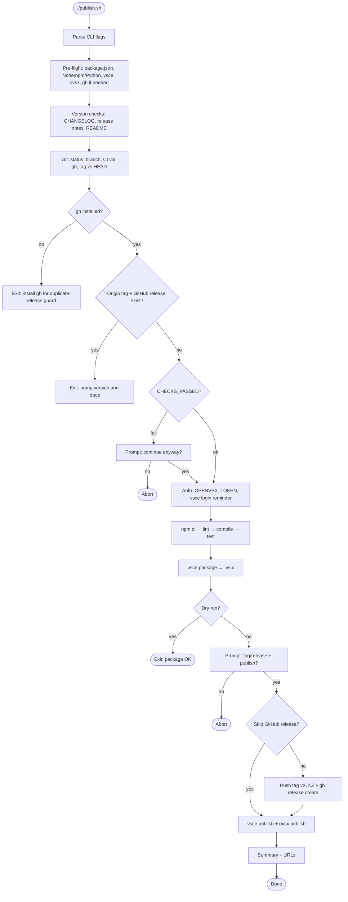
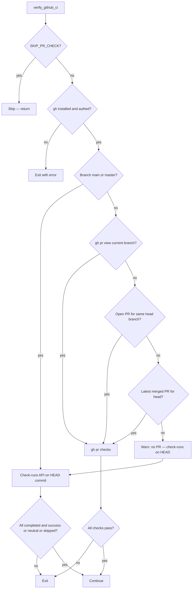
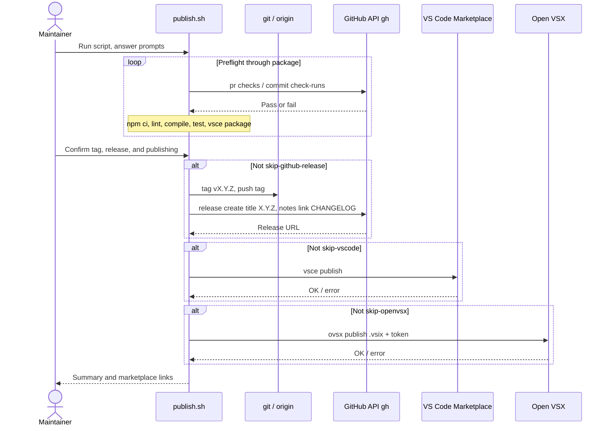

# Publishing the extension (`publish.sh`)

This project ships the **Scientific Data Viewer** VS Code extension to the [VS Code Marketplace](https://marketplace.visualstudio.com/) and [Open VSX](https://open-vsx.org/) using a **local** script at the repository root: [`publish.sh`](../publish.sh).

Publishing is intentionally **not** automated in GitHub Actions for day-to-day releases. A **reference-only**, fully commented workflow lives in [`.github/workflows/publish.yml`](../.github/workflows/publish.yml) if you ever want to revive CI-driven publishing.

---

## Prerequisites

| Requirement | Purpose |
|-------------|---------|
| **Node.js** 22+ | Matches `package.json` / CI |
| **npm** | `npm ci`, `vsce`, tests |
| **Python** 3.13+ | Extension runtime / tests |
| **`@vscode/vsce`** | Global or via `npx` — package and VS Code publish |
| **`ovsx`** | Global or via `npx` — Open VSX publish |
| **[GitHub CLI `gh`](https://cli.github.com/)** + `gh auth login` | PR/CI checks, duplicate-release guard, tag + GitHub Release (unless you skip those features) |
| **`vsce login <publisher>`** | VS Code Marketplace PAT (not stored in the script) |
| **`OPENVSX_TOKEN`** | Open VSX personal access token (environment variable) |

Run the script from the **repository root** (where `package.json` lives).

---

## Usage

```bash
./publish.sh                      # Full flow: checks → build → tag + GitHub release → marketplaces
./publish.sh --dry-run            # Build and package a .vsix only; no publish or GitHub release
./publish.sh --skip-tests         # Skip `npm run test` (use sparingly)
./publish.sh --skip-pr-check      # Skip GitHub PR / Actions verification
./publish.sh --skip-github-release # Marketplaces only; no `git tag` / `gh release`
./publish.sh --help               # Print options
```

You can combine flags (for example `--dry-run` with `--skip-pr-check` if you only want a local package without talking to GitHub).

---

## What the script enforces

1. **Version alignment** — `CHANGELOG.md` section for `package.json` version; optional `UNRELEASED` → dated header (with optional git commit). `README.md` must show **Current Version: v…** and link `docs/RELEASE_NOTES_<version>.md`. Release notes file is expected (you can confirm past the warning if missing).
2. **Git hygiene** — Working tree and branch prompts; local/remote tag must match **HEAD** when a tag already exists.
3. **CI / PR** — Unless `--skip-pr-check`, `gh` verifies that GitHub Actions checks are green (via `gh pr checks` and/or the check-runs API on `HEAD`).
4. **No double release** — If **`gh` is installed**, the script **aborts** when **both** a remote tag `vX.Y.Z` **and** a GitHub Release for that tag already exist (bump version and docs, then retry). If `gh` is missing, the script **exits** with an install hint (the duplicate check cannot run safely).
5. **Order of side effects** — After your confirmation, the script creates/pushes the **git tag** and **GitHub Release** (title `X.Y.Z`, notes link to `CHANGELOG.md` at that tag), **then** publishes to the marketplaces so the release exists before store publication.

---

## End-to-end flow (flowchart)

The diagram below is a simplified view of happy-path and major decision points. Many steps can **exit** on failure (`set -e` and explicit `exit 1`).



---

## CI / PR verification (flowchart)

When `--skip-pr-check` is **not** set and the repo is a git checkout, `verify_github_ci` picks a strategy based on the current branch and available PRs:



---

## Publish phase (sequence diagram)

After **build**, **package**, and (unless dry-run) **confirmation**, interactions with remotes look like this:



---

## Release naming conventions

| Artifact | Convention |
|----------|------------|
| Git tag | `v` + semver from `package.json` (example: `v0.10.1`) |
| GitHub Release title | Semver **without** `v` (example: `0.10.1`) |
| Release notes body | Single line with a permalink to **`CHANGELOG.md`** at that tag on GitHub |

This matches how releases are presented on the [GitHub Releases](https://github.com/etienneschalk/scientific-data-viewer/releases) page for this repository.

---

## Related documentation

- Per-version write-ups: `docs/RELEASE_NOTES_<version>.md`
- Changelog: `CHANGELOG.md` at the repository root
- Extension packaging reference: [Publishing Extensions](https://code.visualstudio.com/api/working-with-extensions/publishing-extension) (VS Code docs)

---

## Troubleshooting (quick pointers)

| Symptom | Hint |
|---------|------|
| `gh` required / not authenticated | Install from [cli.github.com](https://cli.github.com/), run `gh auth login`, or pass `--skip-pr-check` / `--skip-github-release` where documented above |
| Duplicate release exit | Version is already tagged **and** released on GitHub — increment version and refresh CHANGELOG, README, and release notes |
| Open VSX fails | Ensure `OPENVSX_TOKEN` is exported in the shell running the script |
| VS Code publish fails | Run `vsce login <publisher>` with a valid PAT |

For diagram rendering, use GitHub’s built-in Mermaid support, VS Code preview, or any Markdown viewer that supports Mermaid.
